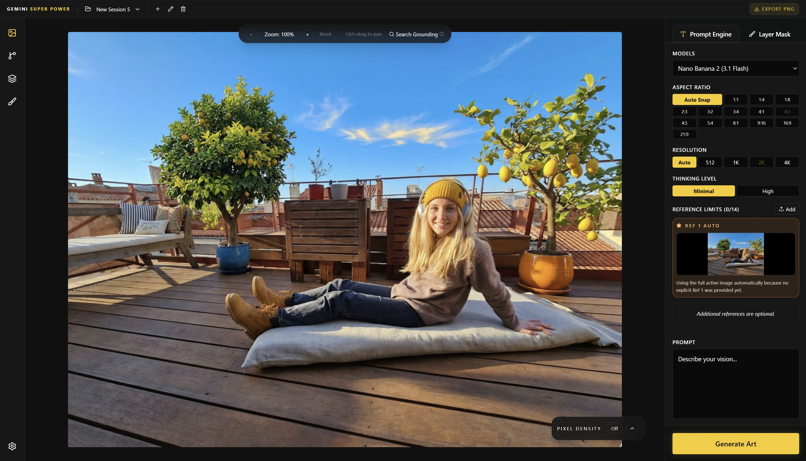
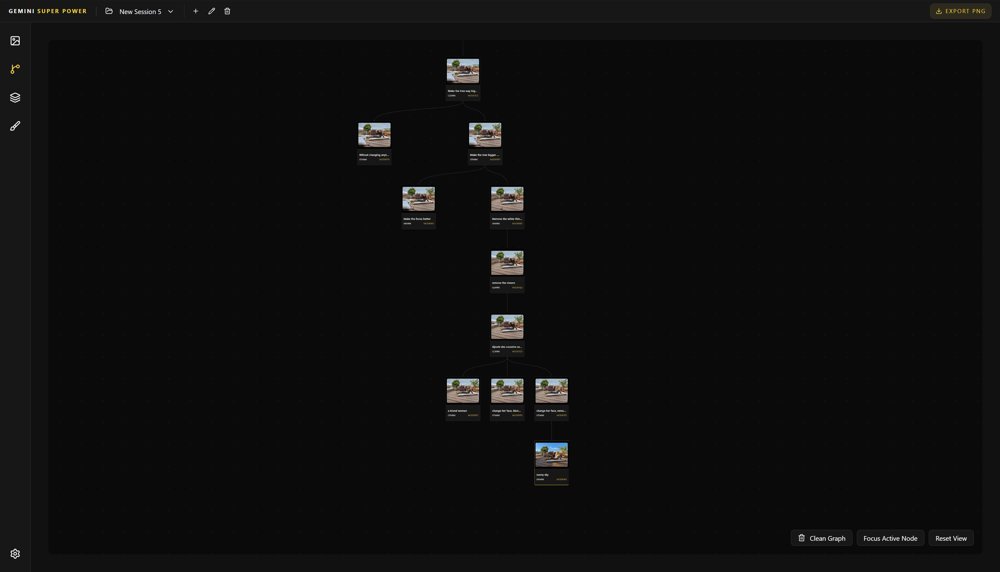
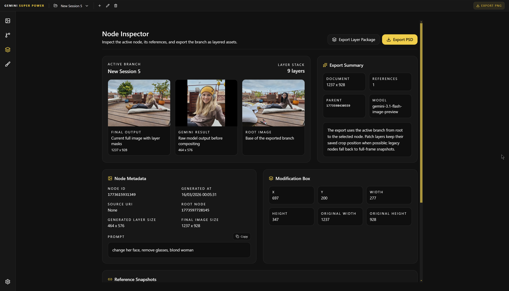
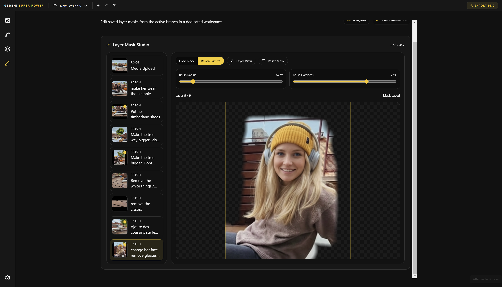

# Gemini Super Power

Gemini Super Power is a desktop creative workspace for iterative Gemini image generation. It combines generation history, branch navigation, reference management, layer masks, pixel-density inspection, PSD/layer export, and Electron packaging in a single app.

## Highlights

- Gemini image generation with Flash and Pro image-preview models
- Branch-based node history with parent/child navigation
- Before/after lineage preview with `A`, `Up`, `Down`, and `Space`
- Layer-based export package and PSD export
- Live layer mask painting on the generation canvas
- Dedicated Layer Mask Studio workspace
- Pixel density heatmap overlay
- Workspace/session persistence in IndexedDB
- Electron desktop packaging and auto-update support through GitHub Releases

## Screenshots

### Generation View



### History Graph



### Node Inspector



### Layer Mask Studio



## Stack

- Vue 3
- TypeScript
- Pinia
- Tailwind CSS
- Vite
- Electron
- electron-builder
- electron-updater

## Requirements

- Node.js 20+ recommended
- npm
- A Google AI Studio API key for generation

## Quick Start

1. Install dependencies:

```bash
npm install
```

2. Start the desktop app in development:

```bash
npm run dev
```

3. Open the app and paste your Gemini API key in `Application Settings`.

## Environment

The app currently uses your Gemini API key from the UI or from `.env`.

Example:

```env
VITE_GEMINI_API_KEY=AIzaSy...
```

## Main Workflows

### Generate

1. Load or create a root image.
2. Draw a selection on the canvas.
3. Ref 1 is filled automatically from the active image if no explicit primary reference is set yet.
4. Enter a prompt and generate.
5. A new node is created with its own metadata, references, result images, and layer information.

### Navigate History

- `A`: hold to preview lineage
- `Up` / `Down`: move backward or forward through the active branch while holding `A`
- `Space`: jump to the currently previewed lineage node while holding `A`

### Edit Layer Masks

In the generation sidebar:

- `X`: switch brush mode between `Hide` and `Reveal`
- `Z`: toggle `Mask View` / `Live View`
- `Ctrl+Z`: undo last mask stroke
- `Ctrl+drag`: pan the canvas when zoomed in

There is also a dedicated `Layer Mask Studio` tab for branch-wide mask editing.

### Export

From the active node you can export:

- Quick PNG
- Layer package folder
- PSD with positioned layers

## Pixel Density Overlay

The generation view includes a pixel-density panel in the bottom-right corner.

- It is closed by default
- It can be toggled independently from the main top capsule
- Opacity is adjustable with a slider
- Density is computed per layer from generated pixel dimensions versus the layer coverage area

## Workspace Data

Sessions are stored locally inside the Electron renderer profile through IndexedDB.

- Store key: `boldbrush_workspaces`
- Legacy migration key: `boldbrush_history`

These keys were intentionally kept for backward compatibility with existing sessions.

## Project Structure

```text
electron/                Main process + preload
public/                  Icons and static assets
src/
  components/            Shared UI and editor components
  services/              Gemini, export, rendering, and utility services
  stores/                Pinia application state
  views/                 Main app views
```

## Build

Create a packaged desktop build without publishing:

```bash
npm run build
```

Create an unpacked app build:

```bash
npm run build:dir
```

## Publish

Auto updates are configured for GitHub Releases on:

- `zerr0o/gemini-super-power`

To publish a release:

1. Make sure the GitHub repository has been renamed to `gemini-super-power`.
2. Create a GitHub token with release upload permissions.
3. Copy [`.env.publish.example`](./.env.publish.example) to `.env.publish.local`.
4. Paste your token into:

```env
GH_TOKEN=your_github_token
```

5. Run:

```bash
npm run publish
```

The publish script reads `.env.publish.local` first, then `.env.publish`, and only falls back to the current terminal environment if no project-specific publish file exists.

## Auto Update Behavior

- Packaged builds check for updates automatically on startup
- Updates download in the background
- Downloaded updates install on quit
- Users can also trigger `Install & Restart` from `Application Settings`

## Packaging Notes

- Product name: `Gemini Super Power`
- App ID: `com.geminisuperpower.app`
- Windows target: `NSIS`
- Output folder: `release/<version>/`

## Troubleshooting

### `spawn EPERM` during build

Some build steps require running outside the desktop sandbox. If `vite build` or `electron-builder` fails with `spawn EPERM`, rerun with elevated permissions from the Codex desktop workflow.

### Auto updates do not trigger

Check the following:

- The packaged app was built from a release configuration
- The GitHub repository exists under the renamed slug
- Release assets and update metadata were published successfully
- The user is running an installed packaged build, not the dev server

### History is missing after a crash

Workspace data is only persistent after a successful IndexedDB save. If the app was reloaded while persistence was failing, the missing nodes may not be recoverable automatically.

## Current Version

- `0.0.2`
